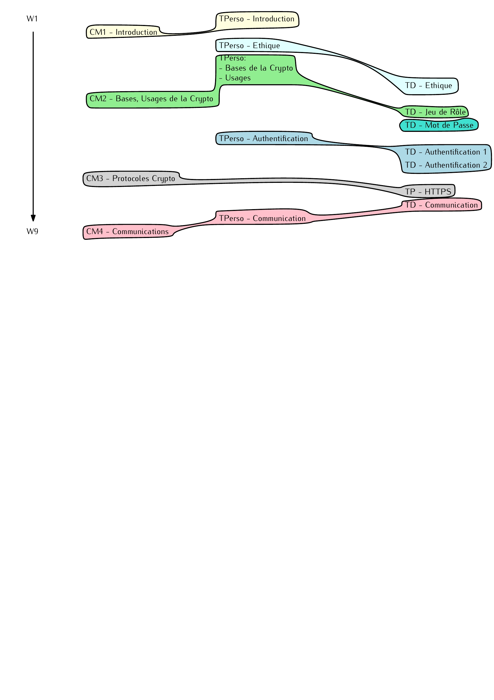

# INSA Lyon - Cours de 4TC(A)-CSC : Cryptographie et Sécurité des Communications

_Lionel Morel ([lionel.morel@insa-lyon.fr](mailto:lionel.morel@insa-lyon.fr))_

<!-- Structure du cours 4TC-CSC
==========================
-->

Le cours 4TC-CSC est structuré de la manière suivante :

* 3 séances de 2h de CM (incluant questions/réponses/discussions)
* 6 TD de 2h
* 1 séance de 4h de TP
* Environ 10h de travail personnel (préparation cours et TP)
* 1 séances de 2h de restitution (noté CM)

Pour chaque séance, vous aurez un travail de préparation qui est
décrit dans la suite de ce document. La préparation consiste à lire
des ressources externes, les comprendre et préparer des questions pour
la séance de cours/TD/TP associée. En bas de cette page, vous
trouverez des questionnaires d'auto-évaluation à réaliser au fur et à
mesure. Attention, le volume de travail personnel n'est pas
négligeable et ne peut donc pas être réalisé au dernier moment, il est
pour cela réservé à l'emploi du temps (même si vous êtes libre de le
faire à un autre moment que le créneau prévu). La préparation a pour
but d'acquérir les _connaissances_ nécessaires pour appréhender les
_compétences_ qui seront vues en CM/TD/TP. Certaines connaissances
sont plus largement discutées dans les heures de face-à-face, mais pas
toutes et il vous revient de poser des questions précises sur les
points que vous aurez étudié de votre coté et qui n'auraient pas
trouvé réponses dans les séances telles qu'elles sont préparées.

<!--
La note finale de l'UE sera calculée comme suit :

* 15% contrôle continu : validation de chaque quizz
* 85% examen final, portant sur les connaissances (travail de préparation) et sur les compétences (heures de CM/TD/TP). Les questions porteront également sur les ouvertures obligatoires et vous devez étudier au moins 1 ouverture facultative au choix.
-->

La structure détaillée est la suivante, la préparation de chaque item est détaillée dans la suite du document :

* Introduction : Travail perso (2h), CM1 (1h30)
* Enjeux éthiques : Travail perso (2h), TD1 (2h)
* Bases de la crypto : Travail perso (2h), CM2 (1h30), TD2 (2h)
* Stockage des mots de passe : TD3 (2h)
* PKI (autorités de certification, DANE et PGP) : Travail perso (2h), TD4, TD5
* Protocoles cryptographiques : CM3 (2h), TP1 (4h)
* Projet d'arpentage communications : Travail perso (2h), TD6 (2h), CM4 (2h)

Pour interagir/discuter/commenter/poser des questions en dehors des heures de cours, vous devez utiliser le canal Discord.

Le cours (pour les séances de travail personnel) est [ici](cours.md)

Les notes de CM : [CM1 (intro)](CM/handout/intro.pdf) / CM2 (Bases) (TBA) / CM3 (protocoles) (TBA)

Les TD : [TD2 (JdR)](td2-jdr.md) / [TD3 (Passwords)](td3-passwords.md) / [TD4 (CA)](td4-ca.md) / [TD5 (DANE/PGP)](td5-danepgp.md)

Les TP : [TP1 (HTTPS)](tp1-https.md)

Le projet d'arpentage communications : [Projet](arpentage.md)

<!--
La page Moodle [TC](https://moodle.insa-lyon.fr/course/view.php?id=4647) / [TCA](https://moodle.insa-lyon.fr/course/view.php?id=4694)
-->

Les questions d'auto-évaluation : [Questions](questions.md)

<!--
Les [annales](https://github.com/flesueur/csc/tree/master/annales)
-->

Licence
=======

 L'intégralité de ce dépôt est mis à disposition selon les termes de la [Licence Creative Commons Attribution - Pas d’Utilisation Commerciale - Partage dans les Mêmes Conditions 2.0 France](https://creativecommons.org/licenses/by-nc-sa/2.0/fr/).
